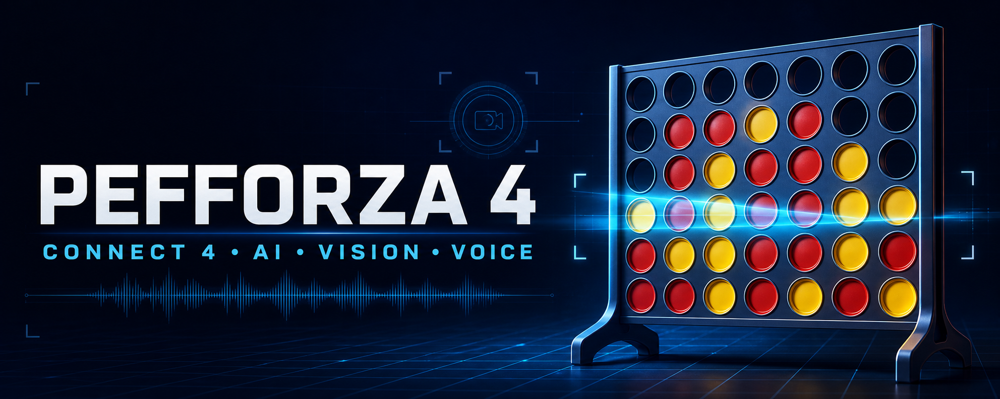
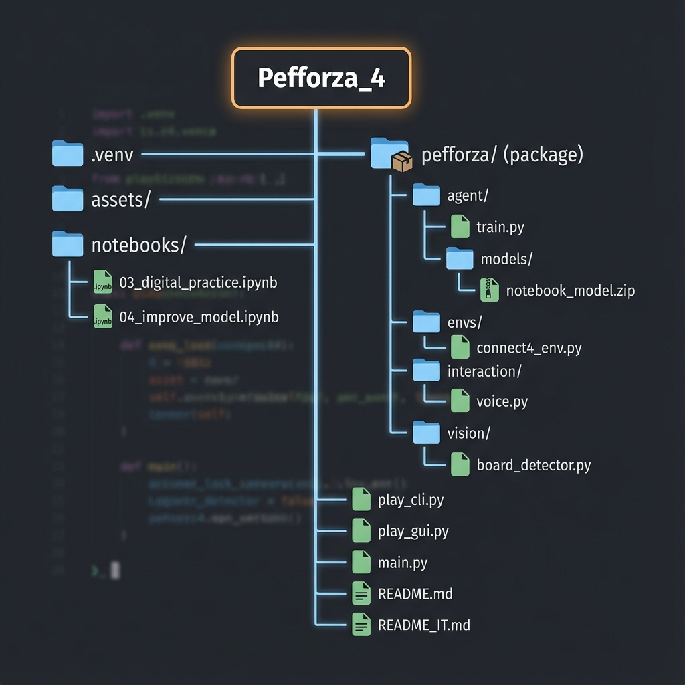

<p align="center">
  
</p>

<h1 align="center">Pefforza 4</h1>

<p align="center">
  <strong>Connect Four powered by AI, computer vision, and voice interaction.</strong>
</p>

<p align="center">
  <a href="https://github.com/tzii/Pefforza_4/actions/workflows/ci.yml">
    
  </a>
  
  
</p>

<p align="center">
  <a href="#quick-start">Quick start</a> &bull;
  <a href="#play">Play</a> &bull;
  <a href="#architecture">Architecture</a> &bull;
  <a href="docs/PROJECT_DEEP_DIVE.md">Technical docs</a>
</p>

Pefforza 4 turns Connect Four into a complete AI project. A webcam can
reconstruct a real 6x7 board, the agent chooses a move, and an augmented-reality
overlay shows the recommendation while optional text-to-speech comments on the
game. The same engine also runs without hardware in a terminal or Pygame GUI.

## Features

- **Computer vision** - webcam calibration and HSV classification detect red
  and yellow tokens on a physical 6x7 board.
- **Multiple AI levels** - random, heuristic, minimax, and a bundled PPO
  checkpoint provide different ways to play and evaluate the agent.
- **Voice interaction** - non-blocking, fail-soft commentary via `pyttsx3`
  automatically disables itself if audio is unavailable.
- **Three play modes** - terminal CLI, Pygame GUI, or an AR assistant for a
  real board.

## Quick start

```bash
git clone https://github.com/tzii/Pefforza_4.git
cd Pefforza_4
python -m venv .venv
# Windows
.venv\Scripts\activate
# macOS / Linux
source .venv/bin/activate
pip install -e ".[dev]"
python play_gui.py
```

Run the activation command for your operating system, then continue with the
installation and launch commands.

## Architecture



### Project layout

- `pefforza/` — installable package
  - `constants.py`, `rules.py` — board geometry and pure game logic (no heavy deps).
  - `cli/` — entrypoint implementations (`play_cli`, `play_gui`, `play_physical`).
  - `envs/connect4_env.py` — Gymnasium environment.
  - `agent/train.py` — PPO trainer with `SinglePlayerWrapper`.
  - `vision/board_detector.py` — calibration + token classification.
  - `interaction/voice.py` — thread-safe TTS wrapper.
- `play_cli.py`, `play_gui.py`, `play_physical.py` — thin shims over `pefforza.cli` so `python play_cli.py` keeps working; `main.py` is a continuously-watching AR variant.
- `notebooks/` — exploratory work (training demo, vision debugging, etc.).
- `tests/` — pytest suite for `rules` and `Connect4Env`.

## Requirements

- Python 3.10 – 3.13
- A C/C++ toolchain isn't needed for normal install; SB3 brings PyTorch (CPU is enough for inference and small-scale training).

## Install

```bash
python -m venv .venv
# Windows
.venv\Scripts\activate
# macOS / Linux
source .venv/bin/activate

# Editable install with dev tooling
pip install -e ".[dev]"
```

If you prefer plain requirements files:

```bash
pip install -r requirements-dev.txt   # runtime + dev
# or, runtime only
pip install -r requirements.txt
```

## Play

The opponent is selectable via `--difficulty`:

| Tier | Engine | Notes |
|---|---|---|
| `easy` | random | Picks any legal column |
| `medium` | 1-ply heuristic | Win-if-you-can, block-if-you-must, prefer center |
| `hard` (default) | bitboard alpha-beta depth 8 | Same heuristic as the matrix baseline, an order of magnitude faster |
| `impossible` | exact bitboard solver (~3s budget) | Proven-optimal moves whenever the proof fits; safe non-losing fallback in the deep opening |
| `neural` | bundled PPO checkpoint | Strength depends on training |

### Terminal

After any `pip install` (editable or from a wheel), the console command is
`pefforza-cli`; the repo-root script works too:

```bash
pefforza-cli                                        # default: hard
python play_cli.py --difficulty impossible          # strongest current heuristic search
python play_cli.py --difficulty medium --voice      # easier opponent + TTS
python play_cli.py --difficulty neural --model my.zip
```

### Pygame GUI

```bash
pefforza-gui --difficulty impossible
# or, from a source checkout:
python play_gui.py --difficulty impossible
```

### Physical board (AR assistant)

```bash
python play_physical.py                              # default: hard
python play_physical.py --difficulty impossible
python play_physical.py --difficulty medium --ai-color yellow --camera 0
```

After the camera window opens, click the four corners of the board (any
order — the detector auto-sorts TL/TR/BR/BL). Press `SPACE` to analyse the
current board, `q` to quit. The recommended column is drawn as an AR arrow
on top of the live feed.

The camera feed is mirrored for a natural calibration experience, so the
arrow is drawn in display space while the printed/HUD recommendation is
translated to the physical board's column numbering (what you count on the
real board, left to right).

`main.py` is a continuously-watching variant of the AR assistant — it reads
the board every frame and announces the AI's move whenever it's the AI's turn.

### Verify the vision pipeline

If physical-board play feels off, check what the detector actually sees:

```bash
python -m pefforza.vision.diagnose             # default camera 0
python -m pefforza.vision.diagnose --camera 1
python -m pefforza.vision.diagnose --flip      # mirror feed first
```

After calibration the tool overlays each detected cell with `X`/`O`/`.` and a
confidence value (0–1). If empty cells show high confidence, lighting is too
dim or your color thresholds need adjusting; if tokens show low confidence,
the camera is glaring or the ROI margin is wrong. Press `s` to save a
`vision_debug.png` snapshot for sharing or further analysis.

Headless unit tests (no camera needed) live in
`tests/test_board_detector.py` and run as part of the standard test suite.

## Train

```bash
python -m pefforza.agent.train --timesteps 50000 --iterations 5
```

Or open `notebooks/04_improve_model.ipynb` for an interactive training loop.

## Test the model (without vision)

The headless evaluator runs your checkpoint against canned opponents and
reports win / loss / draw rates. Sides alternate so first-mover bias doesn't
mislead you.

```bash
# 100 games vs a 1-ply heuristic (win-if-you-can, block-if-you-must, else center)
python -m pefforza.agent.evaluate --opponent heuristic --games 100

# Sanity check vs a uniform-random opponent
python -m pefforza.agent.evaluate --opponent random --games 200

# Compare two checkpoints head-to-head
python -m pefforza.agent.evaluate \
    --model new.zip --opponent model --opponent-model old.zip --games 200
```

For a quick subjective challenge, just run `play_cli.py` or `play_gui.py`.

## Develop

Run the quality gates before pushing:

```bash
python -m ruff check .
python -m ruff format --check .
python -m pytest --cov=pefforza
```

CI runs the same checks on Python 3.10–3.13 (`.github/workflows/ci.yml`).

## Conventions

Player IDs in the environment use **`1` for the agent's perspective and `2`
for the opponent**. The vision pipeline uses **`1 = Red`, `2 = Yellow`**. When
the AI plays Yellow, translate between the two views with
`pefforza.rules.swap_perspective`.

## License

Released under the [GNU Affero General Public License v3.0 or later](LICENSE).
See `LICENSE` for the full text. Contributor guidance lives in
[AGENTS.md](AGENTS.md).
