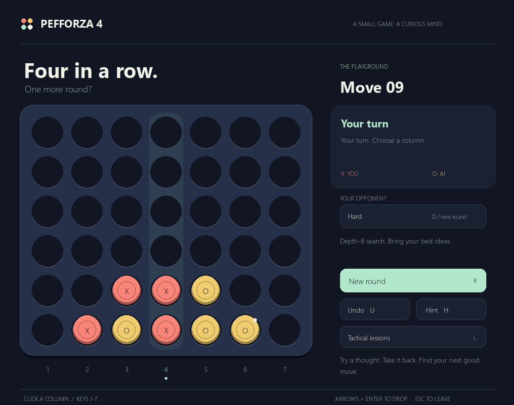
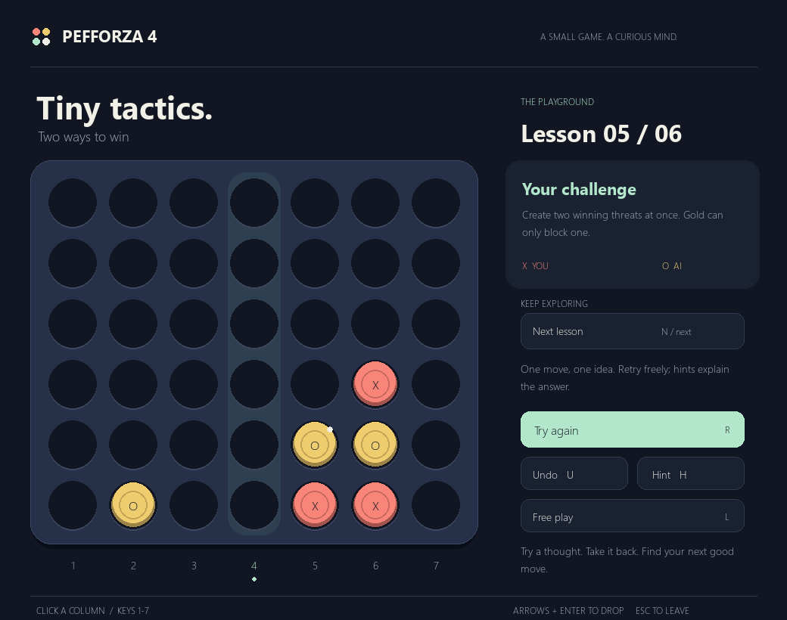
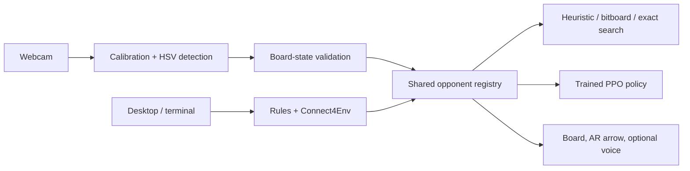

<h1 align="center">Pefforza 4</h1>
<p align="center"><strong>Four in a row. One more round?</strong></p>
<p align="center">A small game. A curious mind. An AI lab you can actually play.</p>

<p align="center">
  <a href="https://github.com/tzii/Pefforza_4/actions/workflows/ci.yml"></a>
  
  <a href="LICENSE"></a>
</p>
<p align="center">
  <a href="#quick-start">Get playing</a> ·
  <a href="#choose-your-opponent">Meet the AI</a> ·
  <a href="#bring-a-real-board">Camera mode</a> ·
  <a href="#the-student-lab">The student lab</a> ·
  <a href="docs/README.md">Go deeper</a>
</p>

Pefforza turns Connect Four into a hands-on student project: play against search
algorithms or a trained neural policy, teach a webcam to read a real board, and
experiment with reinforcement learning. Serious ideas, low-pressure play.

<p align="center">
  
  <br><sub>A real capture of the Pygame app—not a design mockup.</sub>
</p>

## Pick your playground

| Mode | What you get | What you need |
| :--- | :--- | :--- |
| **Desktop** | Animated drops, keyboard controls, explained hints, undo, replay, five AI tiers | A desktop display; no camera or microphone |
| **Terminal** | The same opponents, clean text play, optional spoken commentary | A terminal; audio is optional |
| **Physical board** | Four-click calibration, board validation, an AR move recommendation | An upright red/yellow board, webcam, good lighting |

## Quick start

Use **Python 3.10–3.13**. A CPU is enough; a GPU is not required.

**Development version.** The desktop refresh and lessons are on
`codex/tactical-lessons`. The command below selects that build; the default
branch still contains the earlier interface.

```bash
git clone --branch codex/tactical-lessons https://github.com/tzii/Pefforza_4.git
cd Pefforza_4
python -m venv .venv
```

Activate the environment for your shell:

| macOS / Linux | Windows PowerShell | Windows Command Prompt |
| :--- | :--- | :--- |
| `source .venv/bin/activate` | `.venv\Scripts\Activate.ps1` | `.venv\Scripts\activate.bat` |

Then install and play:

```bash
python -m pip install -e .
pefforza-gui
```

No desktop display? Start with `pefforza-cli`. The first installation downloads
the ML dependencies, even if you plan to play against a search-based opponent.

<details>
<summary><strong>Smaller CPU-only install on Linux / Windows</strong></summary>

Before installing Pefforza, install PyTorch's CPU wheel in your activated environment:

```bash
python -m pip install torch --index-url https://download.pytorch.org/whl/cpu
python -m pip install -e .
```

For other accelerator/platform combinations, use the
[official PyTorch selector](https://pytorch.org/get-started/locally/).

</details>

## Make yourself at home

You play **X / coral**; the AI plays **O / gold**. Connect four horizontally,
vertically, or diagonally. Symbols accompany colors so the board is not
color-only, and the winning line stays highlighted until you choose what is next.

| Desktop control | Action |
| :--- | :--- |
| Click a column or press **1–7** | Drop a piece |
| **← / →**, then **Enter** or **Space** | Select a column and drop |
| **H** / Hint | Suggest a win, block, or move that avoids an immediate losing reply; never plays for you |
| **U** / Undo | Return to your previous decision, including during AI thinking or after a result |
| **R** / New round | Clear the board and play again |
| **D** / Difficulty | Cycle the opponent **and start a new round** |
| **L** / Tactical lessons | Open six short challenges, or return to a fresh free-play round |
| **N** / Next lesson | Advance to the next challenge while in lessons |
| **Esc** / close window | Leave immediately, even while the AI is searching |

Resize the window to fit your screen. Prefer less motion? Run
`pefforza-gui --no-animate`. Use `--seed 4` for repeatable random-opponent sessions.
Hints check the opponent's immediate replies and say when every move allows a
winning reply. They are teaching aids, not deep-search proofs. Undo restores the board;
the restarted AI worker also resets its random sequence and search cache.

### Tiny tactics, one move at a time

```bash
pefforza-gui --lessons
```

Find horizontal, vertical, and diagonal wins; block a threat; create a fork;
and avoid giving your opponent a winning reply. Each challenge starts from a
legal move sequence and checks your answer without playing an AI reply.
**U** or **R** retries the same position, **H** explains it, and **N** moves on.
The final lesson accepts several safe moves—safety here means avoiding an
immediate loss, not proving a win. Completing a lesson does not affect free play.

<p align="center">
  
</p>

## Choose your opponent

| Tier | Personality | Actual engine |
| :--- | :--- | :--- |
| `easy` | A little warm-up | Uniform random legal moves |
| `medium` | A sparring partner | Win now, block now, otherwise prefer the center |
| `hard` **(default)** | Think a few moves ahead | Depth-8 bitboard alpha-beta search with a tactical safety net |
| `impossible` | Challenge the solver | Exact search with a roughly 3-second budget; a short probe in early positions |
| `neural` | Meet the student | Bundled PPO checkpoint; strength depends on training |

**“Impossible” is a challenge name, not an unbeatable guarantee.** Completed
proofs give optimal moves. If the time budget runs out, the fallback avoids an
immediate loss when a safe move exists—but can still miss a deeper tactic.
The neural model is experimental, not automatically stronger than search; if it
cannot load, the game warns and uses the medium-style heuristic instead.
The desktop then labels the opponent **Medium (fallback)**. A worker failure or
timeout is labeled **Legal fallback**; the next turn can retry the requested AI.

```bash
pefforza-gui --difficulty medium
pefforza-cli --difficulty impossible
pefforza-cli --difficulty medium --voice
pefforza-cli --difficulty neural --model path/to/checkpoint.zip
```

The source-checkout shims (`python play_gui.py`, `python play_cli.py`, and
`python play_physical.py`) still work. All three commands support `--help`.

## Bring a real board

```bash
pefforza-physical --difficulty hard --ai-color yellow --camera 0
```

1. Keep the board upright and the camera still. Use diffuse light, not glare.
2. Click its four distinct outer corners, in any order. Press **q** to cancel.
3. Press **Space** after a move (or a complete round) to analyze the board.
4. Read the AR arrow and printed column. Press **r** to reset tracking if the
   board has changed unexpectedly; **q** quits. Moving the camera requires a
   fresh calibration, not just a tracking reset.

Search runs in a cancellable process so the camera window keeps refreshing while
the AI thinks. **r**, **q**, and a new **Space** analysis discard the pending
result. Recommendations refer to the last board you explicitly analyzed; press
**Space** again after moving a piece. Calibration and HSV detection are unchanged
by this responsiveness update.

The feed is mirrored. The arrow uses display coordinates; the printed/HUD column
uses the physical board's left-to-right numbering. Implausible states are
rejected instead of being fed to the AI. Finished games—including draws—stop
recommendations. Clear the board after a result to start again.

**See what the camera sees:**

```bash
python -m pefforza.vision.diagnose --camera 0 --flip
```

The diagnostic view shows cell labels and color-classification confidence.
Press **s** to save `vision_debug.png`, or **q** to quit. Confidence measures color
occupancy, not certainty that the entire game position is correct. Check captures
for people or private surroundings before sharing them.

`main.py` is a separate, continuously watching **neural** AR experiment with the
AI playing yellow. It validates reads, caches recommendations per board, and
supports **r** to resync; it does **not** expose the difficulty selector. Its
voice commentary is optional (`--no-voice`). Start with the Space-triggered mode.

## The student lab

Three good experiments, from a quick afternoon to a deeper project:

**01 · Ask why an AI move works.** Play on medium, ask for a hint, undo, and try
another idea. Then compare the search engines:

```bash
python scripts/benchmark_search.py --depths 6 8 --skip-solver
```

**02 · Train a policy, then measure it.** Training currently faces a random
opponent—it is not competitive self-play. Start small:

```bash
python -m pefforza.agent.train --timesteps 10000 --iterations 2 --seed 4
python -m pefforza.agent.evaluate --model pefforza/agent/models/ppo_connect4.zip --opponent heuristic --games 100 --seed 4
```

Evaluation alternates sides. Try `--opponent random`, or compare checkpoints
using `--opponent model --opponent-model older.zip`. Judge win/loss/draw rates,
not just how convincing a move looks. Training writes new checkpoints; it does
not replace the bundled `notebook_model.zip`. Only load checkpoints you trust.

**03 · Make vision less fragile.** Use the diagnostic tool to compare lighting,
camera angle, and token colors. The next worthwhile research step is measured
color calibration, not a bigger UI around unreliable detections.

The [notebooks](notebooks/) preserve the exploratory side of the project.
Open them in a separately installed Jupyter environment using this project's
Python environment. The [technical notes](docs/README.md) explain the ideas.

## Under the hood



| Area | Start reading here |
| :--- | :--- |
| Board geometry and pure rules | [`constants.py`](pefforza/constants.py), [`rules.py`](pefforza/rules.py) |
| Gymnasium environment | [`connect4_env.py`](pefforza/envs/connect4_env.py) |
| AI tiers and search | [`difficulty.py`](pefforza/agent/difficulty.py), [search notes](docs/search_engine.md) |
| Desktop state, worker, rendering | [`gui_game.py`](pefforza/cli/gui_game.py), [`gui_view.py`](pefforza/cli/gui_view.py) |
| Camera and board validation | [`vision/`](pefforza/vision/) |
| Nonblocking, fail-soft speech | [`voice.py`](pefforza/interaction/voice.py) |

Board arrays are indexed **top-to-bottom**, with zero-based columns internally
and **1–7** in player-facing instructions. The environment stores absolute
player IDs; model input is normalized so **1 = self, 2 = opponent**. Vision uses
**1 = red, 2 = yellow**. Use `swap_perspective`, not hand-written ID swaps.

## Build with us

```bash
python -m pip install -e ".[dev]"
python -m ruff check .
python -m ruff format --check .
python -m mypy
python -m pytest --cov=pefforza
```

Tests cover rules, full games, search equivalence, terminal play, desktop
controls and worker cancellation, every tactical-lesson answer and fork reply,
camera validation, and voice failure paths.
They use synthetic frames and fake devices—not a webcam, speaker, or trained
checkpoint. CI checks Python 3.10–3.13 and smoke-tests the built wheel.

For a headless browser view of the **same Python game controller**, run
`python scripts/preview_gui.py` and visit `http://127.0.0.1:3000`. Browser text
and vector pieces stay crisp when zoomed, and drops animate locally at the
display's refresh cadence instead of streaming low-frame-rate screenshots.
The layout stacks on small screens and respects reduced-motion preferences.
Rules, AI, undo, and lesson answers still run in Python.

This is a local development remote with one shared game, not a production web
service or a browser-based camera mode. Restart the command and refresh the page
after source edits. The browser animation checks use Node 18+:
`node --test tests/test_preview_motion.mjs`. Hoplite uses
the versioned setup/run commands in [`.hoplite/settings.json`](.hoplite/settings.json).

Read [CONTRIBUTING.md](CONTRIBUTING.md) for the workflow and [AGENTS.md](AGENTS.md)
for repository conventions. Prefer small, explainable changes with a regression
test and a reproducible example.

## Honest limits

- Camera accuracy depends on manual calibration, fixed HSV thresholds, lighting,
  and an unobstructed board. A plausible read can still be wrong.
- Real webcam drivers, OS windows, and audible speech need a hardware smoke test.
  Headless tests cannot prove those work on every machine.
- Voice is text-to-speech, **not speech recognition**. Missing audio support
  disables commentary rather than ending a game.
- The bundled neural policy is a learning artifact. Search is the stronger
  default; no tier is advertised as universally unbeatable.

See the [current audit and next experiments](docs/PROJECT_STATUS.md) for evidence,
remaining risks, and a focused roadmap.

The [follow-up review](docs/NEXT_STEPS.md) records Windows verification and an
ordered plan for release, hardware acceptance, and small tactical lessons.

---

<p align="center"><strong>Try a thought. Take it back. Find your next good move.</strong><br>
Built to play with, learn from, and improve together.<br>
<a href="LICENSE">AGPL-3.0-or-later</a></p>
