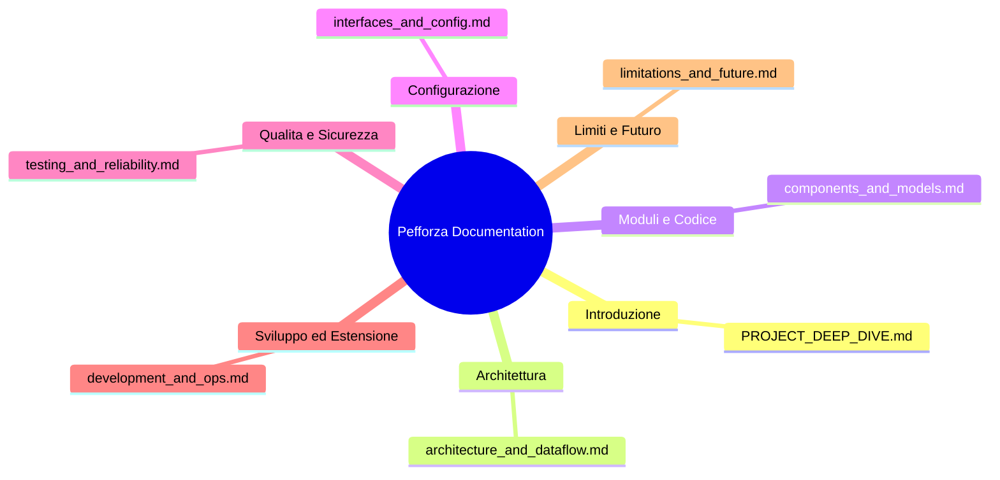

# Documentazione Tecnica Pefforza: Indice Generale

> Questi moduli conservano le note didattiche originali e possono descrivere
> implementazioni precedenti. Per comandi, garanzie e limiti attuali, leggere
> il [README](../README.md) e l'[audit aggiornato](PROJECT_STATUS.md).

Benvenuto nella documentazione tecnica ufficiale del progetto **Pefforza** (Connect 4 AI con Computer Vision, Vocazione TTS ed esecuzione intelligente). 

Questa documentazione è divisa in molteplici moduli esplicativi per consentire una lettura agevole, un onboarding rapido e una comprensione approfondita dei vari moduli.

---

## Mappa dei Documenti

1.  **[PROJECT_DEEP_DIVE.md (Questo file)](PROJECT_DEEP_DIVE.md)**: Introduzione generale, Executive Summary, Problem Statement e mappa di navigazione della documentazione.
2.  **[1. Architettura e Flussi di Dati](architecture_and_dataflow.md)**: Diagramma dei componenti generali, lifecycle di esecuzione (CLI, GUI e AR) e tracciamento dei dati dal frame video della camera fino al calcolo dell'agente.
3.  **[2. Componenti, File e Modelli di Dominio](components_and_models.md)**: Mappa dettagliata del repository, scomposizione classe per classe e file per file, strutture dati in memoria e indicizzazione dei concetti.
4.  **[3. Interfacce, CLI e Configurazione di Ambiente](interfaces_and_config.md)**: Tabella dei comandi a riga di comando supportati, variabili d'ambiente, configurazioni del motore vocale e mappa delle dipendenze runtime/dev.
5.  **[4. Strategia di Test e Robustezza](testing_and_reliability.md)**: Suite pytest, behavioral test contro minacce immediate, gestione degli errori e criteri di affidabilità/sicurezza del codice.
6.  **[5. Guida allo Sviluppo, Esempi ed Estensibilità](development_and_ops.md)**: Installazione, comandi di build/test locale, tracciamento end-to-end di una mossa AR fisica e linee guida per estendere l'IA o la sintesi vocale.
7.  **[6. Limiti, Miglioramenti Futuri e Glossario](limitations_and_future.md)**: Colli di bottiglia computazionali, limiti attuali del riconoscimento visivo, tabella prioritaria dei futuri sviluppi (P0-P3) e glossario dei termini chiave.

---

## 1. Executive Summary

**Pefforza** è un sistema integrato basato su intelligenza artificiale, computer vision e interazione vocale progettato per giocare a Forza 4 (Connect 4) sia digitalmente che su una tavola di gioco fisica reale. Il progetto combina tecniche classiche di ricerca euristica ed algoritmi di Reinforcement Learning per creare un avversario interattivo e stimolante.

### Funzionalità principali
*   **Visione artificiale avanzata**: Tramite una telecamera (webcam) e una calibrazione prospettica guidata, il sistema riconosce la scacchiera fisica $6 \times 7$ e classifica le celle (vuota, pedina rossa, pedina gialla) sfruttando lo spazio colore HSV.
*   **Motori decisionali multipli**: L'utente può scegliere tra 5 livelli di difficoltà, che spaziano dal gioco casuale a un motore Negamax ottimizzato con alpha-beta pruning e iterative deepening, fino ad un modello neurale addestrato tramite l'algoritmo PPO (Proximal Policy Optimization).
*   **Interazione Vocale**: Un motore di Text-To-Speech (TTS) asincrono e "fail-soft" (basato su `pyttsx3`) fornisce commenti in tempo reale sulle mosse dell'IA, migliorando il coinvolgimento emotivo e l'esperienza dell'utente.
*   **Tre modalità di gioco**:
    1.  **Terminale (CLI)**: Per una partita veloce basata su testo.
    2.  **Interfaccia Grafica (GUI Pygame)**: Con animazioni fluide di caduta delle pedine e un sistema di "watchdog" che verifica se l'IA commette errori tattici evidenti.
    3.  **Realtà Aumentata (AR Assistant)**: Proietta una sovrapposizione visiva sul feed della telecamera indicando dove giocare la mossa raccomandata dall'IA sulla scacchiera fisica.

---

## 2. Problem Statement

Il gioco del Forza 4 è ampiamente studiato dal punto di vista accademico: si tratta di un gioco a informazione perfetta risolto matematicamente (il primo giocatore può sempre forzare la vittoria). Tuttavia, il trasferimento di questa logica dal mondo virtuale a una **scacchiera fisica reale** introduce diverse problematiche complesse:

1.  **Bridging tra analogico e digitale**: Leggere lo stato del gioco fisico tramite sensori o telecamere richiede robustezza contro le variazioni di illuminazione, ombre, distorsioni prospettiche della webcam e rumore visivo. Un approccio semplice basato su coordinate fisse fallirebbe non appena la telecamera o la scacchiera si spostano leggermente.
2.  **Valore del tempo reale e latenza**: Gli algoritmi decisionali devono rispondere entro limiti rigidi di tempo per evitare che il gioco risulti frustrante, garantendo al contempo la massima reattività dell'interfaccia utente (evitando, ad esempio, che il ciclo di calcolo del minimax blocchi il rendering grafico o l'audio).
3.  **Sicurezza tattica obbligatoria**: I modelli decisionali neurali basati su RL possono occasionalmente presentare "buchi" tattici e ignorare minacce immediate di vittoria dell'avversario. Il sistema deve disporre di protezioni deterministiche "defense-in-depth" per impedire errori grossolani che minerebbero la credibilità dell'IA.

Pefforza risolve questi problemi implementando:
*   Una pipeline OpenCV con calibrazione a 4 punti prospettici ed elaborazione dinamica della griglia basata su intervalli HSV per i singoli colori delle pedine.
*   Un motore di ricerca Negamax con ottimizzazione dell'ordine delle mosse (preferenza per la colonna centrale) integrato con *Iterative Deepening* basato su budget di tempo per le difficoltà più elevate.
*   Un wrapper deterministico a 1-ply (**Tactical Safety Net**) che previene sviste grossolane intercettando vittorie immediate o minacce avversarie prima di cedere il controllo all'IA euristica/neurale.
*   Un thread separato basato su coda per gestire il Text-To-Speech in modo non bloccante.
