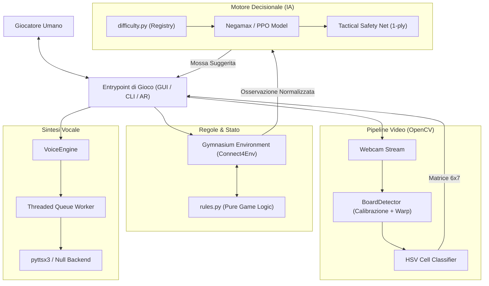
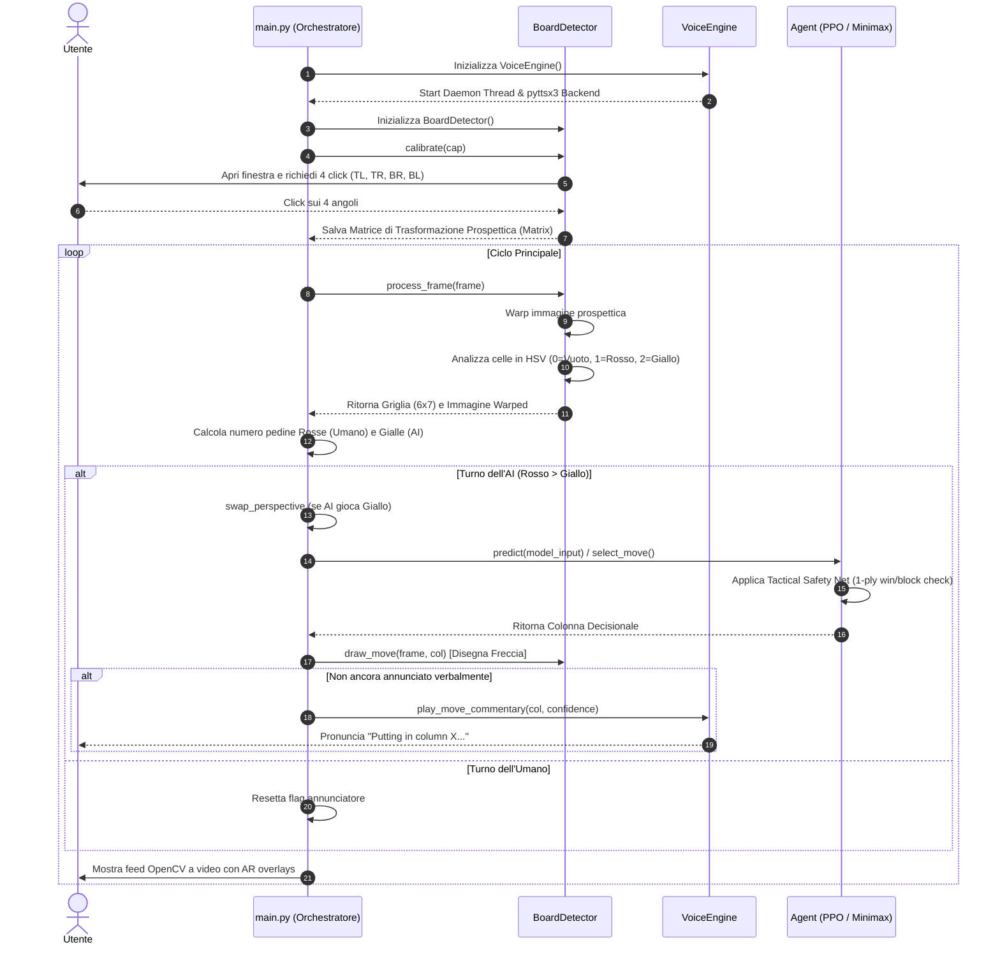
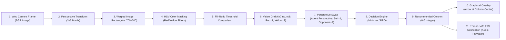

# Architettura di Sistema e Flusso dei Dati

Questo documento analizza l'architettura generale di **Pefforza**, il ciclo di vita dell'esecuzione per ciascun entrypoint e il percorso dettagliato che compiono i dati dall'input hardware all'output dell'utente.

---

## 1. High-Level Architecture
L'architettura del sistema Pefforza segue un modello modulare disaccoppiato in cui i moduli di interazione e visione comunicano con il motore logico e decisionale attraverso strutture dati standardizzate (principalmente array NumPy 2D).

### Dettaglio dei blocchi architetturali:
1.  **Entrypoint (Livello di Orchestrazione)**: Riceve gli input utente (clic del mouse, tastiera o coordinate dei corner visivi), coordina i componenti, avvia il ciclo di gioco e disegna le informazioni sullo schermo (Pygame o OpenCV).
2.  **Vision Pipeline**: Rileva la scacchiera fisica a 4 punti. Esegue una trasformazione di prospettiva lineare per correggere l'inquadratura ottenendo un'immagine rettangolare pulita da analizzare cella per cella.
3.  **Core Game Logic**: Mantiene lo stato formale della partita (tabellone $6 \times 7$), applica la fisica della gravità del Forza 4 e decide se c'è un vincitore o un pareggio. L'ambiente Gymnasium fa da wrapper per l'addestramento dell'agente neurale.
4.  **Decision Engine**: Seleziona la colonna migliore in cui inserire la pedina. Riceve lo stato normalizzato del tabellone e utilizza l'agente opportuno a seconda della difficoltà scelta. Applica sempre la `tactical_safety_net` per garantire mosse sensate e prive di errori immediati.
5.  **Interaction Engine**: Un'architettura basata su thread produttore-consumatore. Il thread principale invia frasi testuali da pronunciare alla coda decodificata da un daemon worker, impedendo che le chiamate sincrone di `pyttsx3` blocchino il frame rate del gioco.

---

## 2. Main Execution Flow
Il flusso di esecuzione varia in base all'entrypoint. Analizziamo in dettaglio il flusso per l'assistente visivo continuo ([main.py](../main.py)):

### Ciclo di vita dei singoli Entrypoint:
*   **play_cli.py**: Inizializza l'ambiente `Connect4Env`, avvia un ciclo `while not (terminated or truncated)`. Chiede l'input all'utente su console tramite validazione (`get_human_action`). Per l'IA, calcola il tempo di pensiero, invia il comando TTS per la mossa e chiama `env.step()`.
*   **play_gui.py**: Avvia l'interfaccia Pygame. Nel ciclo principale gestisce gli eventi `MOUSEMOTION` (sposta l'anteprima della pedina rossa in alto) e `MOUSEBUTTONDOWN` (rilascia la pedina). Esegue una sequenza di animazione interpolata quadratica prima di aggiornare lo stato di gioco interno. Se il turno è dell'IA, mostra lo stato "AI thinking..." ed esegue l'agente. Dispone del *Watchdog* integrato che scrive su `watchdog.log` in caso di mancate parate tattiche del motore di gioco.
*   **play_physical.py**: Permette all'utente di giocare a turni assistiti. Il flusso rimane in attesa di comandi da tastiera. Premendo la barra spaziatrice `[SPACE]`, la webcam cattura un fotogramma, estrae lo stato attuale del tabellone tramite `process_frame` del `BoardDetector`, verifica lo stato di vittoria ed esegue una singola predizione del modello visualizzando una freccia persistente sulla colonna raccomandata.

---

## 3. Data Flow
Il viaggio dei dati all'interno del sistema Pefforza segue un ciclo lineare in cui i dati analogici (video) vengono convertiti in matrici digitali discrete, manipolati e infine restituiti come output visivi o vocali.

### Struttura e passaggi della pipeline dati:
1.  **Input Video**: Frame grezzo acquisito via OpenCV in spazio BGR.
2.  **Omografia prospettica**: L'immagine viene proiettata tramite omografia prospettica per rettificare la scacchiera fisica a una dimensione uniforme di $700 \times 600$ pixel.
3.  **Filtraggio HSV**: La scacchiera rettificata viene convertita in HSV. Vengono estratti due canali maschera: uno per il Rosso (con due intervalli per gestire il wrap del colore sull'asse H) e uno per il Giallo.
4.  **Misura della confidenza**: Per ciascuna delle 42 celle ($6 \times 7$), viene calcolata la frazione di pixel attivi nella maschera. Se supera il $30\%$ (`_FILL_THRESHOLD`), la cella viene etichettata con il rispettivo colore.
5.  **Normalizzazione dell'agente**: Lo stato visivo identifica il Rosso con `1` e il Giallo con `2`. Per essere compreso dal modello addestrato (che assume sempre di essere il giocatore `1`), lo stato passa attraverso `rules.swap_perspective` qualora l'IA stia giocando come giallo (secondo giocatore).
6.  **Decisione e Output**: L'azione restituita (ID colonna) viene invertita se la telecamera è stata specchiata a schermo, disegnando una freccia indicativa sopra la colonna bersaglio e inviando il testo audio al thread vocale.
